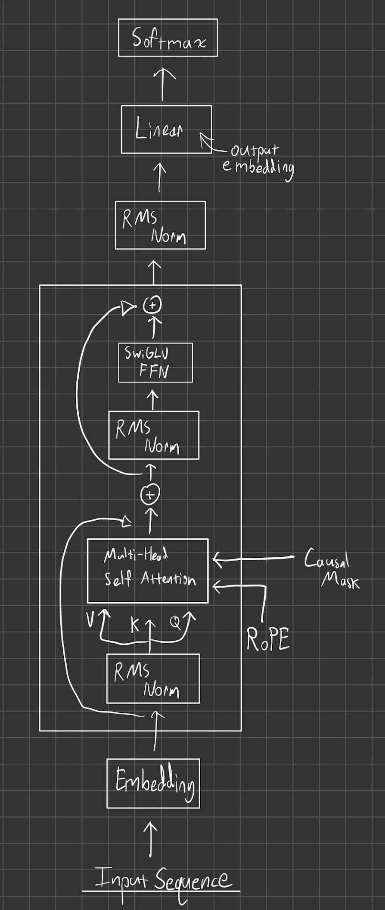

# Calvin - Transformer LM from scratch

*PyTorch implementation of a custom Transformer architecture built from scratch*

[Features](#key-features), [Architecture](#architecture-overview) 

---

## Overview

Calvin is a Transfomer model I developed from scratch, inspired by Stanford CS336 and NanoGPT. It features a 50k vocabulary trained from [Cosmopedia](https://huggingface.co/datasets/HuggingFaceTB/cosmopedia/tree/main/data) and [OpenHermes](https://ollama.com/library/openhermes:v2).

---

## Key-Features

- **BPE Tokenizer:** Byte Pair Encoding Tokenizer from scratch
- **Custom Multi-Head Self-Attention:** PyTorch implementation supporting causal masking and custom head dimensions
- **RoPE:** Rotary Positional Embeddings (RoPE)

## Architecture-Overview
Model takes an input sequence of and outputs probability distribution over vocabulary.

---

